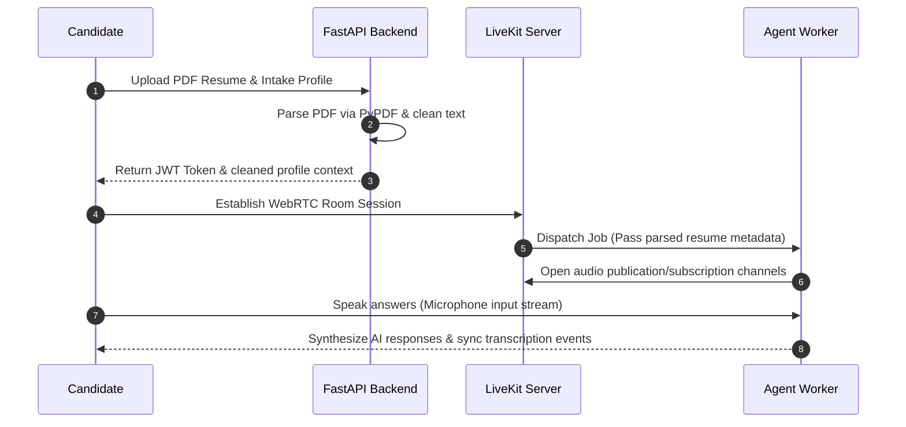

# AI-Powered Voice Interview Coach

An advanced, real-time technical voice interviewer project built to simulate realistic corporate screening rounds for AI/ML engineering positions. The app ingests candidate profiles, parses PDF resumes, establishes low-latency WebRTC voice sessions, and displays real-time transcriptions in a clean web dashboard.

---

## 🛠️ Technical Stack & Architecture

- **Backend API**: **FastAPI** (Python web framework) with Uvicorn, featuring server-side CORS middleware.
- **Document Processing**: **PyPDF** for extracting, parsing, and cleaning text contents from binary PDF resumes.
- **Voice Agent Worker**: **LiveKit Agents** framework featuring:
  - **STT (Speech-to-Text)**: AssemblyAI Universal Streaming (low-latency transcription).
  - **LLM (Language Model)**: OpenAI `gpt-4o-mini` (expert system prompt reasoning).
  - **TTS (Text-to-Speech)**: Cartesia `sonic-3` (ultra-low latency voice synthesis).
  - **VAD (Voice Activity Detection)**: Silero VAD (voice detection model).
- **Web UI Client**: Modern glassmorphic HTML5/CSS3 client utilizing standard vanilla Javascript and the `livekit-client` WebRTC SDK.

### System Sequence Flow



---

## 🚀 Key Features

1. **FastAPI & PyPDF Resume Ingestion**: Instantly parses PDF resumes on the backend to avoid sending raw binary data or garbage bytes to the language model.
2. **Dynamic AI Interviewer Prompt**: The AI Coach adapts questions dynamically depending on the candidate's target role, experience, skills (e.g. *FastAPI, LangChain, LangGraph, Deep Learning*), and resume context.
3. **Advanced Voice Turn-Handling**:
   - `min_endpointing_delay = 1.2s`: Prevents the agent from cutting in during thoughtful candidate pauses.
   - `min_interruption_words = 3`: Prevents false self-interruptions from candidate breathing, background noise, or short backchannel acknowledgements.
4. **Persistent Live Transcript Chatbox**: Displays user speech bubble streams in real time alongside interviewer responses for permanent visual reference.
5. **Port-Lock Exclusivity Guards**: Local TCP singleton lock guards (`55055` for agent, `55056` for backend, `55057` for frontend) to prevent multiple duplicate background python zombie processes on Windows.

---

## 💻 Getting Started

### Prerequisites

Clone the repository and install the dependencies (recommended using `uv`):

```bash
uv sync
```

Create a `.env` configuration file in the project root:

```env
LIVEKIT_URL=wss://your-project.livekit.cloud
LIVEKIT_API_KEY=API...
LIVEKIT_API_SECRET=SEC...
OPENAI_API_KEY=sk-...
CARTESIA_API_KEY=ct_...
ASSEMBLYAI_API_KEY=...
```

### Running the Services

Start each service in a separate terminal:

1. **Terminal 1: Start the Voice Agent Worker**
   ```bash
   uv run livekit_agent.py dev
   ```

2. **Terminal 2: Start the FastAPI Backend Server**
   ```bash
   uv run backend.py
   ```

3. **Terminal 3: Start the HTML Web Server**
   ```bash
   python frontend.py
   ```

Open your browser to `http://localhost:3000`, configure your details, upload your PDF resume, and click **🚀 Start** to begin!
